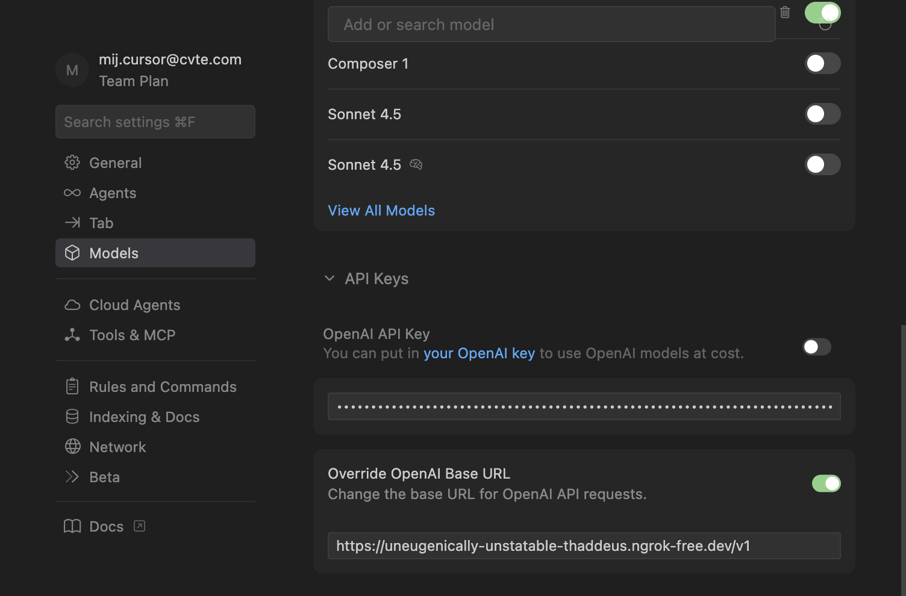
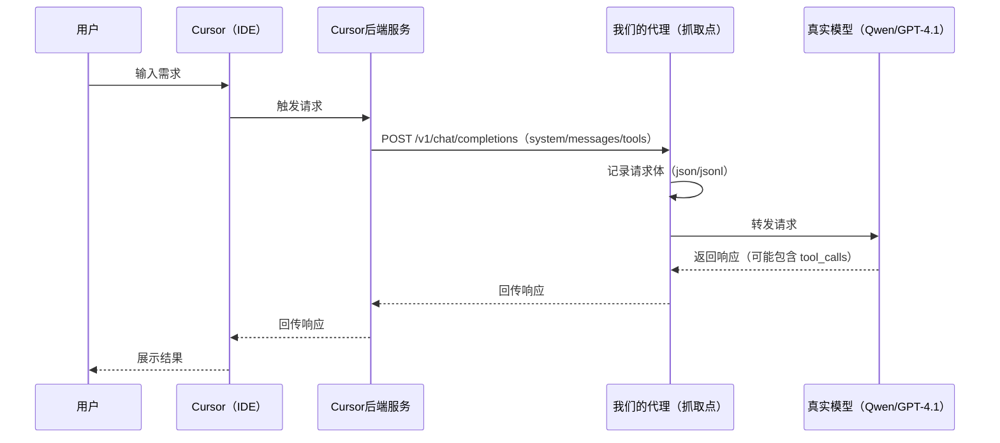
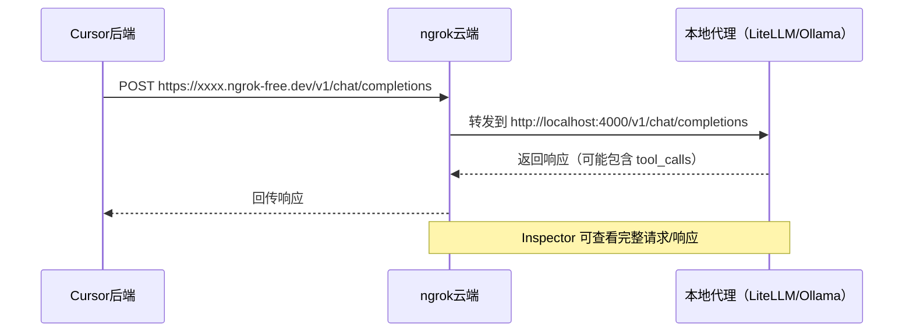
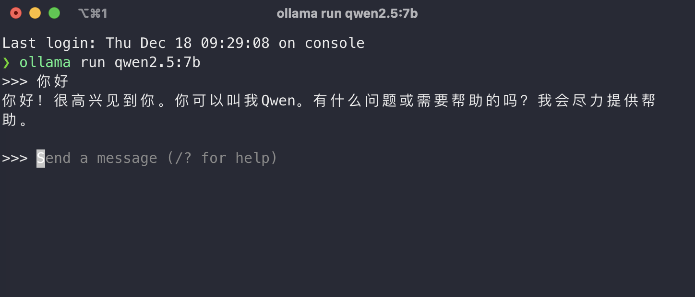

# Cursor 提示词抓取与解密


## 1. 背景


我们想做的是一个面向**备课场景**的 Agent 助手：能基于已有的课件做AI的编辑和优化，类似cursor的agent模式，例如：

[点击观看演示视频](./assets/agent演示.mp4)

- 结合新课标优化课件（总结课件内容->联网检索新课标内容->分析优化思路->优化课件（文生图、视频、课件页、课堂活动、智能体等等））
- 自由的对话，回答老师的问题，总结课件内容，单点工具调用
- 使用react和plan模式，完成复杂任务的编辑和实现

做这类 Agent 时，最大的风险不是“模型不够聪明”，而是**系统设计不够工程化**：上下文怎么组织？工具怎么定义？输出怎么保证可解析？失败怎么回到闭环？这些都不是靠一句 prompt 能解决的。


### 可以参考优秀的软件是怎么设计的，比如cursor

Cursor 是少数把 IDE 场景 Agent 跑得比较顺的产品。我们抓取提示词不是为了“复制一段 system”，而是为了把它的机制拆开看清楚：

- **它每一轮到底给模型喂了什么**（system / messages / tools）？
- **这些东西怎么一起工作**，让模型在 IDE 里读/搜/改/验更稳定？
- **Plan / Agent 模式为什么会让行为明显不一样**？

> 但是cursor是一个黑盒，无法直接看到prompt是怎么发送和工作的，我们要做的就是怎么把这个黑盒变成可观测。
>

---


## 2. 抓取Cursor 的提示词

### 2.1 原理：在 Cursor 与自定义模型之间加一个“代理观察点”


> 我们能做这件事，靠的是 Cursor 支持配置 OpenAI 兼容的自定义接口（Base URL）。  
通过我们的抓包分析，当你把 Base URL 指向我们自己的服务时，链路更接近：

- **本地 Cursor（IDE）→ Cursor 后端服务 → 我们的代理（抓取点）→ 真实模型**

也就是说：IDE 侧触发请求后，Cursor 的后端会向我们配置的 Base URL 发起 `POST /v1/chat/completions`；我们在代理侧记录请求体并转发给真实模型，响应再按原路回传。






### 2.2 本地小模型尝试代理cursor的流量（Ollama + Qwen2.5:7b + ngrok）

#### ngrok 的原理与作用（为什么它是本文的核心组件）

- 什么是 ngrok：一个“反向隧道”服务。它通过本地客户端与云端建立持久的出站连接，为你的本地端口（如 4000/11434）分配一个公网可访问的地址（如 https://xxxx.ngrok-free.dev）。外部对该公网地址的 HTTP 请求，会被安全地转发到你的本地服务。
- 工作原理（简化）：
  - 本地启动 ngrok 客户端，建立到 ngrok 云端的持久连接（TLS）。
  - ngrok 云端分配子域名，并把到该域名的外部请求经隧道转发到你的本地端口。
  - ngrok Inspector（默认 http://127.0.0.1:4040）提供“抓包/回放”，可查看请求/响应的头、体、源 IP、延迟等。
- 在本文链路中的作用：
  - 让 Cursor 后端服务能够访问你本地的代理服务（LiteLLM/Ollama），无需公网服务器。
  - 作为“最靠近 Cursor 后端的一层观察点”，直接看到完整请求体（system/messages/tools）和响应，是提示词解密的关键抓手。
  - 快速调试与对比：可以在不改 Cursor 客户端的情况下，切换不同上游模型，观察 Agent/Plan 模式差异。
- 关键特性与注意事项：
  - 通道类型：常用的是 `ngrok http http://localhost:PORT`（HTTP 隧道）；也支持 TCP 隧道，IDE 场景通常 HTTP 即可。
  - 安全：隧道地址对公网可见，避免暴露敏感接口；可通过 ngrok 的 authtoken、Basic Auth、IP 白名单等方式做保护；严禁把真实 API Key 写入文档/代码。
  - 时延与稳定性：经云端中转会增加 RTT，适合开发/调试，不建议直接用于生产；生产可考虑 Cloudflare Tunnel/自建反向代理。
  - 速率限制：免费域名存在速率/带宽限制，大量抓包时可能限流。
  - 抓包隐私：Inspector 会保存请求/响应体，注意清理或脱敏。




> 参考文章：`https://zhuanlan.zhihu.com/p/1897219344594888402`


#### 实验步骤（尽量按这个顺序做）

1. **安装并启动 Ollama**

```bash
brew install ollama
ollama pull qwen2.5:7b
ollama run qwen2.5:7b

curl http://localhost:11434/api/generate -d '{
  "model": "qwen2.5:7b",
  "prompt": "用一句话介绍 Ollama"
}'

# 让服务监听 0.0.0.0，便于 ngrok 转发（默认可能只监听 127.0.0.1）
OLLAMA_HOST=0.0.0.0 ollama serve
```




2. **用 ngrok 暴露 Ollama 端口**

```bash
brew install ngrok
ngrok http http://localhost:11434

curl https://uneugenically-unstatable-thaddeus.ngrok-free.dev/api/generate -d '{
  "model": "qwen2.5:7b",
  "prompt": "写一个冒泡排序算法"
}'
```

启动后注意两点：

- ngrok 会给你一个公网地址（`https://YOUR_NGROK_URL`）
- ngrok 的抓包界面一般在 `http://127.0.0.1:4040`


3. **在 Cursor 里把模型 Base URL 指向 ngrok**

在 Cursor 的 Models 配置里新增/选择自定义模型：

- Model name：`qwen2.5:7b`
- Base URL：`https://YOUR_NGROK_URL/v1`
- API Key：随便填（如果后端不校验）


4. **触发一次请求，并在 ngrok Inspector 里看请求体**

随便发起一个问题（建议用 Agent 模式发起一次“读/改/验证”类需求），然后去 `http://127.0.0.1:4040` 看 `POST /v1/chat/completions` 的请求体。

跑通后我们在抓包/代理侧会看到两个非常直观的现象：

- `messages[0]` 是一段很长的 system（里面不是一句话，而是一堆规则、格式、工具说明）；
- 很多请求里还会出现 `tools`（取决于模式、模型与配置），也就是 Cursor 把“能用的工具说明书”一起发给模型。


另外从抓包里还能看到：**发往我们 Base URL 的请求源并不是本机**（ngrok Inspector 会显示 remote addr/地理位置等信息）。结合现象与链路推断，我们认为这一步请求是由 **Cursor 的后端服务**代发的。


但现在问题也很明显：小模型经常“理解不了这套复杂协议”，常见表现是：

- 对话里错误多、格式不稳定；
- 工具调用很难有效跑起来（要么不按 schema，要么根本不走 tool_calls）。


> 这个时候其实能够看到提示词的整体框架，但是对于工具的调用细节其实很不清晰，因为模型的能力，没法按照正常的情况输出

那如果换成大模型的话，我们本地又无法部署大尺寸模型，该怎么办呢？


### 2.3 换大模型接口，把“可用样本”抓出来（LiteLLM proxy + ngrok + GPT-5）

这一步我们把本地代理换成 LiteLLM 的 OpenAI 兼容代理，让 Cursor 仍然以 OpenAI 风格请求；区别是上游走 `gpt-5`（同级模型也可以）。

#### 实验步骤（推荐用 LiteLLM 自带 proxy，更贴近“OpenAI 兼容”这条路）

1. **安装 LiteLLM proxy**（对应 `litellm/LiteLLM本地部署方案.md`）

```bash
pip install 'litellm[proxy]'
```

2. **准备 Key（用环境变量注入，避免写进文档/配置）**

```bash
export OPENAI_API_KEY="YOUR_OPENAI_API_KEY"
```

> 注意：不要把真实 Key 写进文档/配置并分享或提交。

3. **核心代理代码**（对应 `litellm/server.py`）

```python
import traceback
import json
import os
from fastapi import FastAPI, Request
from fastapi.responses import JSONResponse, StreamingResponse
import litellm

# 开启 litellm 调试
litellm.set_verbose = True

# API 配置（请用环境变量注入，避免硬编码泄漏）
# - 下游真实模型的鉴权 key（如需）
API_KEY = os.getenv("UPSTREAM_API_KEY", "")

# 模型配置
MODEL_CONFIG = {
    "gpt-5": {
        # 下游真实模型的 base url（示例占位，按实际环境设置）
        "api_base": os.getenv("UPSTREAM_API_BASE_GPT5", "http://YOUR_UPSTREAM_API_BASE"),
        "model": "gpt-5"
    }
}

app = FastAPI(title="LiteLLM Proxy Server")


@app.post("/v1/chat/completions")
async def chat_completions(request: Request):
    try:
        body = await request.json()
        model = body.get("model") or "gpt-5"
        messages = body.get("messages", [])
        stream = body.get("stream", False)
        tools = body.get("tools")
        tool_choice = body.get("tool_choice")
        user = body.get("user")

        # 清理 messages：移除空的 tool_calls
        cleaned_messages = []
        for msg in messages:
            cleaned_msg = {k: v for k, v in msg.items() if k != "tool_calls" or (v and len(v) > 0)}
            cleaned_messages.append(cleaned_msg)

        messages = cleaned_messages

        # 获取模型配置
        config = MODEL_CONFIG.get(model, MODEL_CONFIG["gpt-5"])

        # 移除不需要的参数
        extra_params = {k: v for k, v in body.items() if k not in ["model", "messages", "stream", "tools", "tool_choice", "user"]}

        if stream:
            # 流式响应
            async def generate():
                response = await litellm.acompletion(
                    model=config["model"],
                    messages=messages,
                    api_key=API_KEY,
                    api_base=config["api_base"],
                    stream=True,
                    tools=tools,
                    tool_choice=tool_choice,
                    user=user,
                    **extra_params
                )
                async for chunk in response:
                    if hasattr(chunk, "model_dump_json"):
                        payload = chunk.model_dump_json()
                    else:
                        payload = json.dumps(chunk, ensure_ascii=False)
                    yield f"data: {payload}\n\n"
                yield "data: [DONE]\n\n"

            return StreamingResponse(generate(), media_type="text/event-stream")
        else:
            # 非流式响应
            response = await litellm.acompletion(
                model=config["model"],
                messages=messages,
                api_key=API_KEY,
                api_base=config["api_base"],
                tools=tools,
                tool_choice=tool_choice,
                user=user,
                **extra_params
            )
            return JSONResponse(content=response.model_dump())

    except Exception as e:
        print(f"Error: {str(e)}")
        print(traceback.format_exc())
        return JSONResponse(
            status_code=500,
            content={"error": {"message": str(e), "type": "server_error"}}
        )


@app.get("/v1/models")
async def list_models():
    return JSONResponse(content={
        "object": "list",
        "data": [
            {"id": "gpt-5", "object": "model", "owned_by": "openai"}
        ]
    })


@app.get("/health")
async def health():
    return {"status": "ok"}


if __name__ == "__main__":
    import uvicorn
    uvicorn.run(app, host="0.0.0.0", port=4000)
```

4. **启动 LiteLLM proxy（本地监听 4000）**（对应 `litellm/LiteLLM本地部署方案.md`）

```bash
cd "./litellm"
litellm --config config.yaml --port 4000 --detailed_debug
```

服务启动后，代理地址为：`http://localhost:4000`  

5. **先用 curl 验证代理是通的（核心“代码”就是这份请求体）**（对应 `litellm/LiteLLM本地部署方案.md`）

```bash
curl http://localhost:4000/v1/chat/completions \
  -H "Content-Type: application/json" \
  -d '{
    "model": "gpt-5",
    "messages": [{"role": "user", "content": "Hello!"}]
  }'
```

6. **用 ngrok 暴露 4000**

```bash
ngrok http http://localhost:4000
```

7. **Cursor 指向 ngrok 的 `/v1`**

- Base URL：`https://YOUR_NGROK_URL/v1`
- Model：`gpt-5`（与 `config.yaml` 的 `model_name` 一致）

8. **触发请求，抓取完整请求包**

抓取点有两个：

- **ngrok Inspector**：直接看到 **Cursor 后端 → 我们代理** 的请求体（最直观）


## 第三部分：Cursor 提示词解密

### 3.1 先从样本建立直觉：一轮请求包由什么组成？

打开 `ursor_eg.json`，至少能看到三块：

- `model`
- `messages`（system + 多轮历史 + IDE 注入上下文）
- `tools`（工具定义与 schema）

结构上可以这样理解：

```text
Request Payload（第 N 轮）
├─ model
├─ messages[]
│  ├─ [0] system：协议底座（身份/格式/工具规则/安全边界…）
│  ├─ [1..k] user/assistant：历史对话 + IDE 注入上下文
│  └─ [可选] tool：工具执行结果回填（若发生过 tool call）
└─ tools[]：工具定义（schema + 约束）
```

